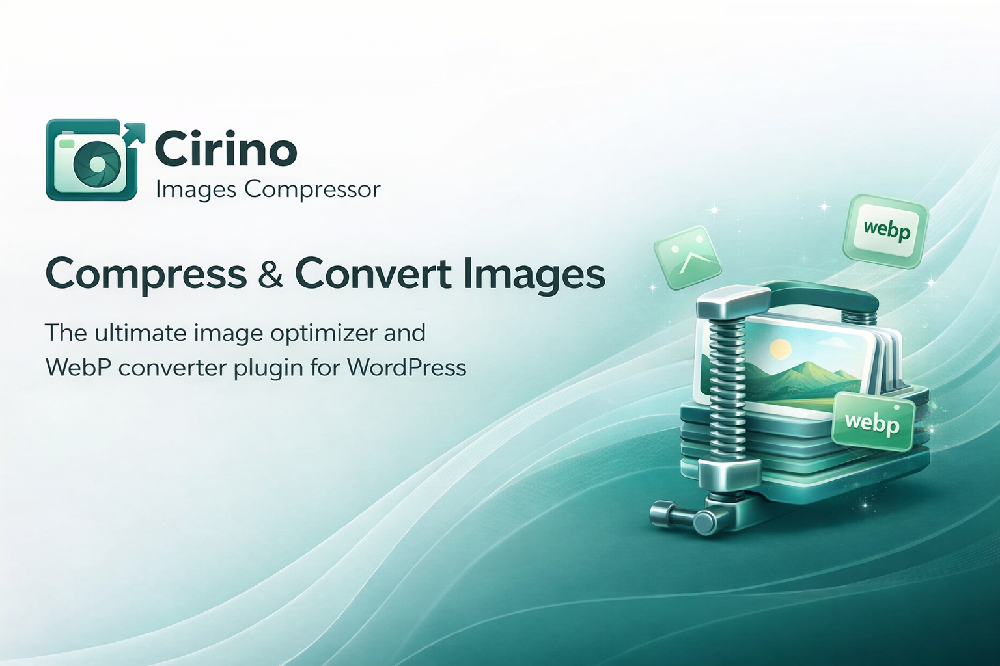
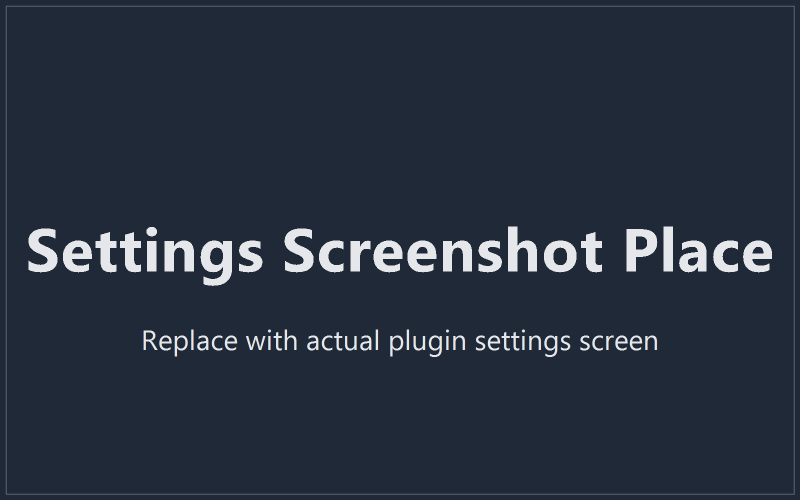
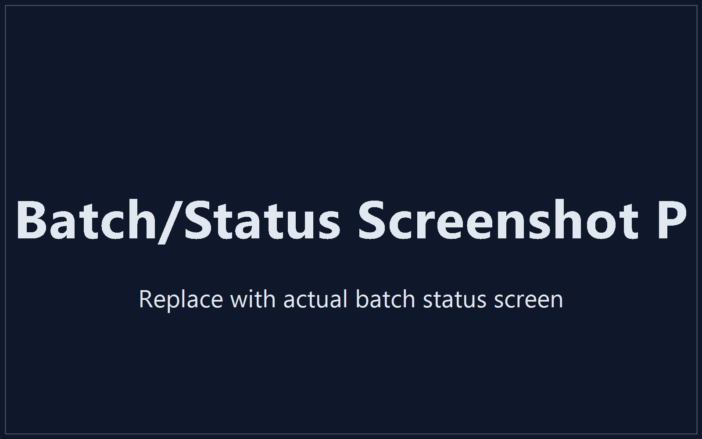

# Cirino Images Compressor

WordPress plugin for image compression and optimization focused on visual quality, real size reduction, and a safe fallback chain across engines.



## ✨ Overview

**Cirino Images Compressor** optimizes Media Library images with a format-specific pipeline, multiple compression levels, and a fallback architecture designed to work well on modest environments (Apache/Nginx, shared hosting, basic VPS) without breaking the default WordPress workflow.

## ✅ Key Features

- Optimization levels: `lossless`, `balanced`, `aggressive`, `ultra`
- Format-specific pipeline:
  - JPEG/JPG: re-encode + configurable quality + progressive mode + metadata stripping
  - PNG: aggressive flow with priority for `pngquant` + `oxipng`, preserving transparency
  - WebP: optional generation for original files and sub-sizes
  - AVIF: optional when real support is available
- Chained fallback:
  1. Binários locais (`pngquant`, `oxipng`, `cwebp`, `avifenc`)
  2. Imagick
  3. GD / default WordPress encoder
- Operational safety:
  - validates real MIME type
  - skips SVG files
  - creates backup before overwrite
  - keeps original when optimized output is larger
- Compatible with Media Library and WordPress-generated sizes
- Modern admin interface with tabs and real-time status

## 🧠 Native Hooks Used

- `wp_editor_set_quality`
- `image_editor_output_format`
- `wp_image_editors`
- `wp_generate_attachment_metadata`

## 🖼️ Interface Screenshots

### Settings Screen



### Batch and Status Screen



## 🏗️ Architecture (Summary)

- `includes/class-cic-capabilities-detector.php`: detects server capabilities
- `includes/class-cic-optimizer-interface.php`: common provider contract
- Providers:
  - `class-cic-binary-optimizer-provider.php`
  - `class-cic-imagick-optimizer-provider.php`
  - `class-cic-gd-optimizer-provider.php`
- `includes/class-cic-file-conversion-service.php`: orchestrates pipeline/fallback
- `includes/class-cic-converter.php`: main batch and metadata workflow
- `includes/class-cic-admin-page.php`: admin page

## 🚀 Installation

1. Copy the plugin folder to `wp-content/plugins/cirino-images-compressor`
2. Activate it in the WordPress admin
3. Go to `Tools > Images Compressor`
4. Adjust settings and run bulk optimization

## 🧪 Local Tests

```bash
composer install
composer test
```

## 📦 Expected Visual Assets in the Repository

This README references the following files:

- `docs/images/banner.png`
- `docs/images/screenshot-settings.png`
- `docs/images/screenshot-batch.png`

## 📄 License

GPLv2 or later.
